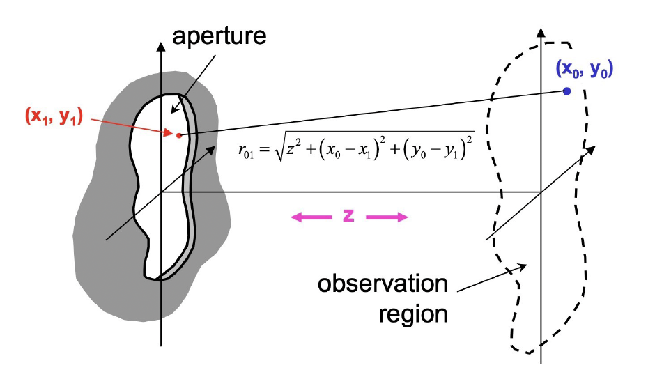

As you might have spotted, close to the aperture, the pattern is still local and busy. Farther away, surprisingly clean structure emerges. The functional form of the theoretically expected result is known and described by $\text{sinc}(x) = \frac{\sin(x)}{x}$, which we already preempted.

The most natural question is: _how do we know what to expect?_ The answer to this the theoretical assessment of the problem, which was done writing the problem down geometrically:

Solving the task involved the Kirchhoff integral, which described how the electric field of a wave looks after passing the aperure.

$$
E(x_0, y_0) \propto \iint
\exp\!\left[
i k \left(
\frac{x_1^2 - 2 x_0 x_1}{2 z}
+
\frac{y_1^2 - 2 y_0 y_1}{2 z}
\right)
\right]
\, \text{Aperture}(x_1, y_1)\, E(x_1, y_1)\, dx_1\, dy_1
$$

As this is quite hard to solve, doing the _Fraunhofer_ or _Far-field_ approximation, the terms become easy and we get

$$
\begin{align}
E(x_0, y_0) \propto & \iint
\exp\!\left[
i k \left(
\frac{- 2 y_0 y_1 - 2 x_0 x_1}{2 z}
+
\underbrace{{\frac{x_1^2 + y_1^2 }{2 z}}}_\text{negligible}
\right)
\right]
\, \text{Aperture}(x_1, y_1)\, E(x_1, y_1)\, dx_1\, dy_1\\
&\boxed{\propto \iint  \exp\!\left[  - \frac{i k}{z} \left(
y_0 y_1 + x_0 x_1\right)\right]
\, \text{Aperture}(x_1, y_1)\, E(x_1, y_1)\, dx_1\, dy_1}
\end{align}
$$

For all alert readers this screams the first fundamental result of our course: **Diffraction of light at an aperture produces a Fourier transformation of the aperture when catching it in the far field**. And interestingly, this applies for any kind of aperture or object!

With this first pillar in place, lets take a well-deserved look into the Fourier transformation apart from the formulas.

# Fourier Intuition

Long story short: far-field diffraction is not chaos, the structure is deeply tied to Fourier behavior. The next challenge is to move from accepting Fourier transforms as a principle to mentally switching between real-space and frequency-space language without feeling like you changed subjects, once you look at a signal or an image.

The cleanest way to get there is to begin in 1D, where frequency components are familiar sine and cosine building blocks, and then carry that exact logic into 2D, where the basis functions become plane waves with direction and spatial frequency. Nothing fundamentally new is introduced in that jump, but your visual intuition has to catch up, and that is precisely what this section is for.

It should help you to treat the Fourier transform less like a mysterious operation and more like a coordinate change. You are describing the same object in a basis where some questions become easier to answer.

In the interactive sequence below, start by turning individual 1D components on and off, then alter amplitudes and phases until the reconstruction behavior feels intuitive rather than surprising. After that, move into the 2D decomposition view and watch the same logic reappear with directional components. A question to check your understanding: if you can explain, how the superposition of frequencies produces the signal, can you also explain why some components are 0?
