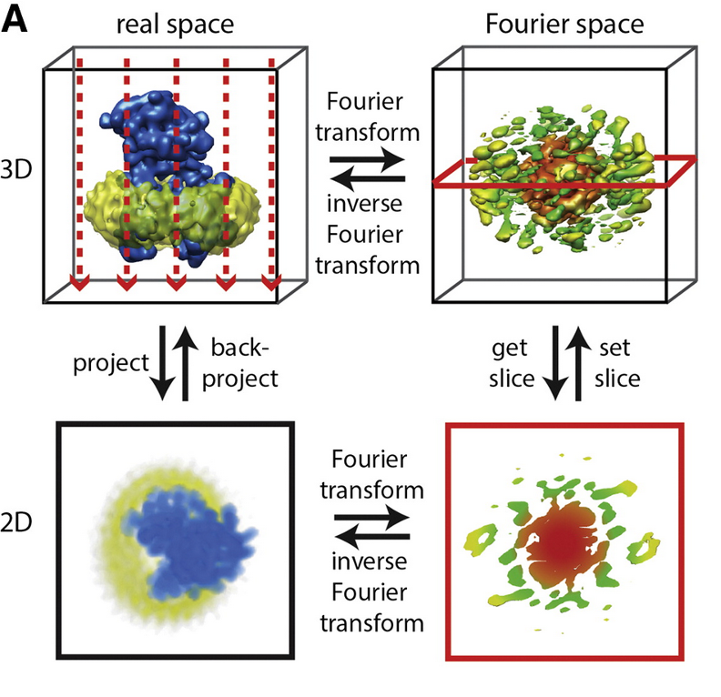

In a nutshell, this is the proof for our treatment of the cat as an image. As the scattering takes place in a single plane for us, this projection is what we transform back and receive an image from. This is allowed by the _projection slice theorem_ which is covered and explained below.

We want to hand over with that by giving you this thought: one beautiful projection is still incomplete information. Next we quantify how many differently oriented slices we need before a reconstruction becomes reliable.

### Projection-Slice and Orientation Coverage: Why One View Is Never Enough

As said above, a single slice in Fourier space gives us a slice in 2D real space. And importantly, one projection gives one orientation-dependent Fourier slice, not the whole 3D information of the object. This is the short version of the projection slice theorem.

So even a very clean single image is still fundamentally incomplete. The way out is to image many particles in many orientations, so different slices accumulate and cover enough of 3D Fourier space for reconstruction.

There is one useful pattern to recall. Low spatial frequencies are sampled redundantly because almost every slice passes through the center of reciprocal space. High spatial frequencies are harder: they are direction-specific and need many well-distributed orientations. This is exactly why reconstructions often recover broad shape first and fine detail later.

Another practical point: more views help, but gains are not linear forever. At finite pixel size, some additional angles become partially redundant. In other words, there is a point where you still improve, but with diminishing returns.

To make this a little more intuitive, we choose a simpler projection / density, essentially some Gaussian blobs.

When you explore the widget, it helps to go in this order:

1. Start with a very small number of angles and inspect the reconstruction error.
2. Increase angle count step by step and watch how MSE and PSNR change.
3. Pay attention to which features appear early (global shape) and which appear late (fine structure).

Quick self-check: if quality still improves at 32 angles but only a little compared with 16, can you explain that using finite sampling and slice overlap?
